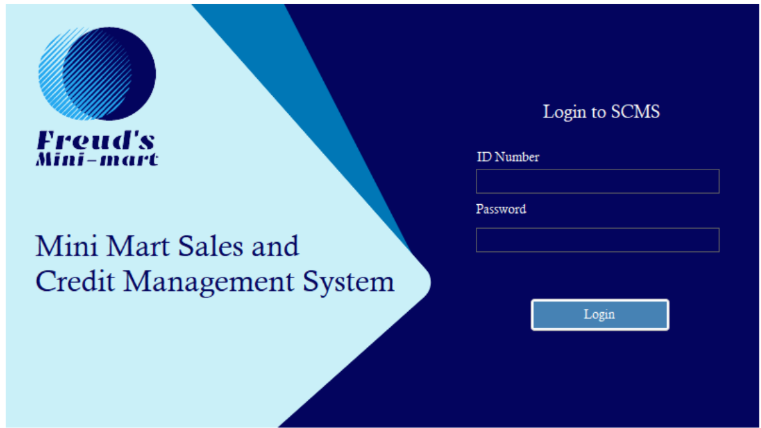
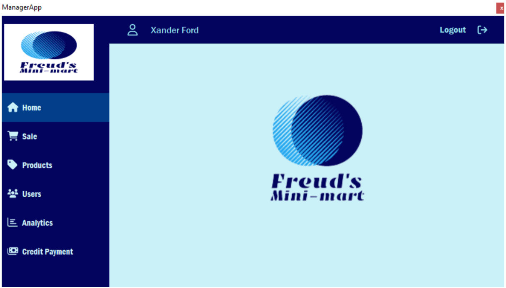
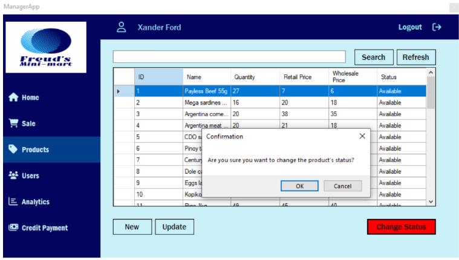



<h2> Sari-sari Store POS </h2>

## 💡 Overview

This project focuses on the development of a **Mini-Mart Sales and Credit Management System** aimed at improving the efficiency and accuracy of business operations in small to medium-sized convenience stores. The system automates key processes such as sales tracking, inventory management, and customer credit handling—replacing traditional, error-prone manual methods.

Designed with user-friendly dashboards for both **cashiers** and **managers**, the system enables real-time monitoring and management of daily transactions and credit sales. It provides valuable insights to support informed decision-making and enhance financial performance.

The system was developed using **C# for the front-end interface** and **MySQL for the back-end database**, following a structured approach that includes planning, design (using tools like Draw.IO for flowcharts and diagrams), development, and testing. This solution is particularly beneficial for SMEs looking to streamline operations and improve overall business management.

## ✨ Features

- **User Authentication:** Secure login with personalized access levels.
- **Product Management:** Create, view, update, and delete product in stock.
- **Credit Management:** Manage the credits of all the customers in the sari-sari store.

## 👩‍💻 Tech Stack

- **C# WinForms:** Use for building the Windows application.
- **MySQL:** A relational database mananagement system to save all products and transactions.